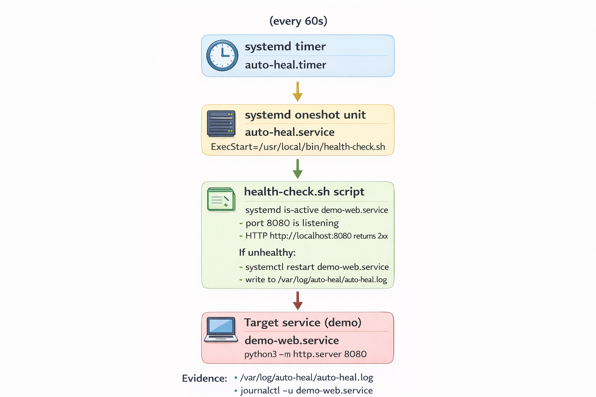
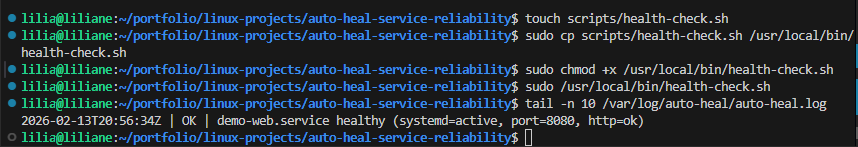
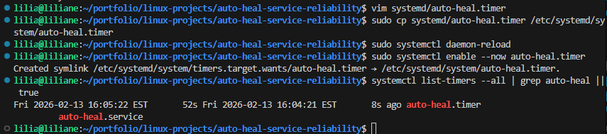
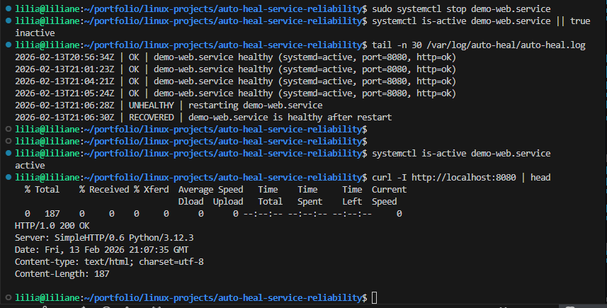

# Auto-Heal Service Reliability (systemd + Health Check Script)

**Goal:** If a service goes down, the server detects it and restarts it automatically.

In this project, I built a simple **auto-heal reliability setup** on Linux. A **systemd timer** runs my **health-check script** every 60 seconds. If the service is unhealthy, the script **restarts it automatically** and writes proof to a log.

This is the same reliability idea used in real operations: **detect → recover → log evidence**.

---

## Screenshots (GitHub-visible)

To make screenshots render on GitHub, I keep them inside the repo and reference them with **relative paths**:

- Folder: `./screenshots/`
- Example: ``

**Important (common reasons images don’t show):**
- The image files are not committed/pushed (`git add screenshots/*.png && git commit && git push`)
- Filename/case mismatch (GitHub is case-sensitive): `01-timer-running.png` ≠ `01-Timer-Running.PNG`
- The README is in a different folder than `screenshots/` (paths must be relative to where the README lives)

---

## Problem

In real systems, a service can fail without warning:

- the process crashes
- the port stops listening
- the HTTP endpoint hangs or starts returning errors
- the service looks “running” but users can’t reach it

When this happens, downtime increases, tickets come in, and someone has to jump in to restart the service manually.

---

## Solution

I implemented a lightweight “auto-heal” pattern using **systemd + Bash**:

- I wrote a **health-check script** that verifies:
  - the service is **active** in systemd
  - the service port is **listening**
  - the HTTP endpoint responds with **2xx/3xx**
- If the service is unhealthy, my script:
  - **restarts** the service
  - logs what happened in **/var/log/auto-heal/auto-heal.log**
- I wrapped the script in a **systemd oneshot service**
- I scheduled it with a **systemd timer** to run every 60 seconds

---

## Architecture Diagram



*Screenshot — Architecture diagram (`screenshots/architecture.png`)*

---

## Step-by-step CLI

> I wrote these steps for Ubuntu/Debian, but it works the same on most Linux systems that use systemd.

### Step 1 — Create the project folders

**Goal:** Keep the repo organized.

```bash
mkdir -p auto-heal-service-reliability/{scripts,systemd,screenshots}
cd auto-heal-service-reliability
````

---

### Step 2 — Install dependencies

**Goal:** Make sure I can run HTTP checks.

```bash
sudo apt update
sudo apt install -y curl
```

---

### Step 3 — Create the demo service (target)

**Goal:** Run a simple service that I can intentionally break and then auto-recover.

Create this file:

**File: `systemd/demo-web.service`**

```ini
[Unit]
Description=Demo Web Service (Auto-Heal Lab)
After=network.target

[Service]
Type=simple
User=root
WorkingDirectory=/opt/demo-web
ExecStart=/usr/bin/python3 -m http.server 8080
Restart=on-failure
RestartSec=2

[Install]
WantedBy=multi-user.target
```

Install and start it:

```bash
sudo mkdir -p /opt/demo-web
sudo cp systemd/demo-web.service /etc/systemd/system/demo-web.service
sudo systemctl daemon-reload
sudo systemctl enable --now demo-web.service
```

Verify it’s working:

```bash
systemctl is-active demo-web.service
curl -I http://localhost:8080 | head
```

---

### Step 4 — Create the health check script

**Goal:** Detect unhealthy behavior and restart automatically with a clear audit log.

Create this file:

**File: `scripts/health-check.sh`**

```bash
#!/usr/bin/env bash
set -euo pipefail

SERVICE_NAME="demo-web.service"
URL="http://localhost:8080"
PORT="8080"

LOG_DIR="/var/log/auto-heal"
LOG_FILE="${LOG_DIR}/auto-heal.log"

mkdir -p "${LOG_DIR}"
touch "${LOG_FILE}"
chmod 0644 "${LOG_FILE}"

ts() { date -u +"%Y-%m-%dT%H:%M:%SZ"; }

log() {
  echo "$(ts) | ${1}" | tee -a "${LOG_FILE}" >/dev/null
}

is_systemd_active() {
  systemctl is-active --quiet "${SERVICE_NAME}"
}

is_port_listening() {
  timeout 2 bash -c "cat < /dev/null > /dev/tcp/127.0.0.1/${PORT}" >/dev/null 2>&1
}

is_http_ok() {
  local code
  code="$(curl -sS -o /dev/null -m 2 -w "%{http_code}" "${URL}" || true)"
  [[ "${code}" =~ ^2|^3 ]]
}

restart_service() {
  log "UNHEALTHY | restarting ${SERVICE_NAME}"
  systemctl restart "${SERVICE_NAME}"
  sleep 2

  if is_systemd_active && is_port_listening && is_http_ok; then
    log "RECOVERED | ${SERVICE_NAME} is healthy after restart"
    exit 0
  else
    log "FAILED | ${SERVICE_NAME} still unhealthy after restart"
    exit 1
  fi
}

main() {
  if is_systemd_active && is_port_listening && is_http_ok; then
    log "OK | ${SERVICE_NAME} healthy (systemd=active, port=${PORT}, http=ok)"
    exit 0
  fi

  restart_service
}

main "$@"
```

Install the script:

```bash
sudo cp scripts/health-check.sh /usr/local/bin/health-check.sh
sudo chmod +x /usr/local/bin/health-check.sh
```

Run it once manually (this also creates the log file):

```bash
sudo /usr/local/bin/health-check.sh
tail -n 10 /var/log/auto-heal/auto-heal.log
```

#### Screenshot — Proof the script writes audit logs



*Screenshot file: `screenshots/02-auto-heal-log.png`*

---

### Step 5 — Create the systemd service that runs the script

**Goal:** Run the health-check through systemd so I can track execution in logs.

Create this file:

**File: `systemd/auto-heal.service`**

```ini
[Unit]
Description=Auto-Heal Health Check (runs health-check.sh)
After=network.target

[Service]
Type=oneshot
ExecStart=/usr/local/bin/health-check.sh
```

Install it:

```bash
sudo cp systemd/auto-heal.service /etc/systemd/system/auto-heal.service
sudo systemctl daemon-reload
```

Test it:

```bash
sudo systemctl start auto-heal.service
sudo systemctl status auto-heal.service --no-pager
```

---

### Step 6 — Create the timer (runs every 60 seconds)

**Goal:** Make the health check run automatically forever (until I disable it).

Create this file:

**File: `systemd/auto-heal.timer`**

```ini
[Unit]
Description=Run Auto-Heal Health Check every 60 seconds

[Timer]
OnBootSec=30
OnUnitActiveSec=60
AccuracySec=5
Unit=auto-heal.service

[Install]
WantedBy=timers.target
```

Install and enable it:

```bash
sudo cp systemd/auto-heal.timer /etc/systemd/system/auto-heal.timer
sudo systemctl daemon-reload
sudo systemctl enable --now auto-heal.timer
```

Verify it is scheduled:

```bash
systemctl list-timers --all | grep auto-heal || true
```

#### Screenshot — Timer running



*Screenshot file: `screenshots/01-timer-running.png`*

---

### Step 7 — Simulate a failure (prove the auto-heal works)

**Goal:** Break the service on purpose and confirm the timer restarts it.

Stop the service:

```bash
sudo systemctl stop demo-web.service
systemctl is-active demo-web.service || true
```

Wait up to 60 seconds, then check my audit log:

```bash
tail -n 30 /var/log/auto-heal/auto-heal.log
```

Confirm the service is back:

```bash
systemctl is-active demo-web.service
curl -I http://localhost:8080 | head
```

Expected log lines include:

* `UNHEALTHY | restarting demo-web.service`
* `RECOVERED | demo-web.service is healthy after restart`

#### Screenshot — Service healthy after recovery



*Screenshot file: `screenshots/03-service-healthy.png`*

---

## Outcome

After finishing this project, I have:

* A real working **self-healing** mechanism using systemd
* A reusable pattern: **timer → script → restart → log**
* Proof logs that show exactly **when the service failed** and **when it recovered**
* A practical troubleshooting workflow using:

  * `systemctl`
  * `journalctl`
  * `curl`
  * port checks

This is a small project, but it demonstrates real reliability thinking and Linux operations skills.

---

## Troubleshooting

### Timer is enabled but not triggering

```bash
systemctl status auto-heal.timer --no-pager
systemctl list-timers --all | grep auto-heal || true
```

Restart it:

```bash
sudo systemctl daemon-reload
sudo systemctl restart auto-heal.timer
```

---

### Script runs manually but fails in systemd

```bash
journalctl -u auto-heal.service --since "30 minutes ago" --no-pager
ls -l /usr/local/bin/health-check.sh
```

---

### Auto-heal restarts but service stays unhealthy

```bash
journalctl -u demo-web.service --since "30 minutes ago" --no-pager
ss -lntp | grep 8080 || true
curl -v http://localhost:8080
```

---

### Health check always reports unhealthy

```bash
systemctl list-units --type=service | grep demo-web || true
curl -I http://localhost:8080 | head
```

---

## Cleanup

```bash
sudo systemctl disable --now auto-heal.timer || true
sudo systemctl disable --now demo-web.service || true

sudo rm -f /etc/systemd/system/auto-heal.timer
sudo rm -f /etc/systemd/system/auto-heal.service
sudo rm -f /etc/systemd/system/demo-web.service
sudo systemctl daemon-reload

sudo rm -f /usr/local/bin/health-check.sh
sudo rm -rf /opt/demo-web
sudo rm -rf /var/log/auto-heal
```


