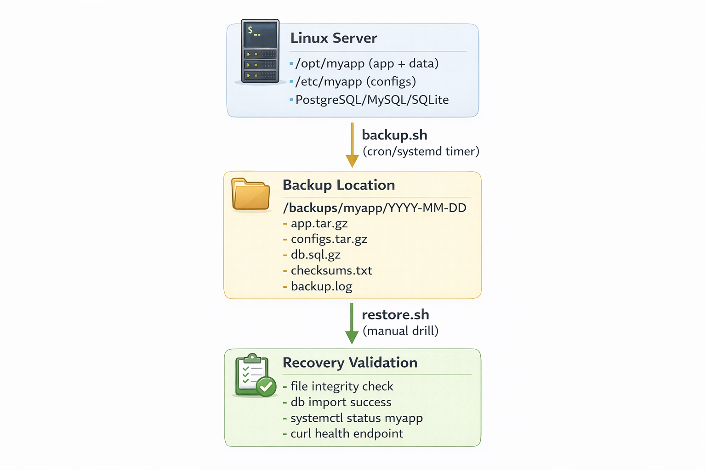
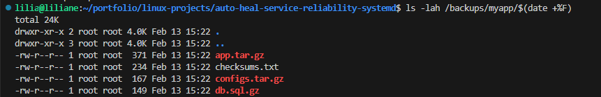
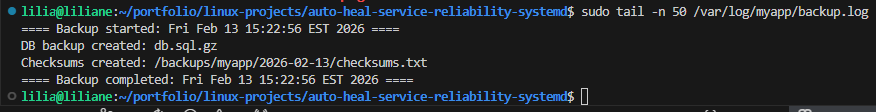
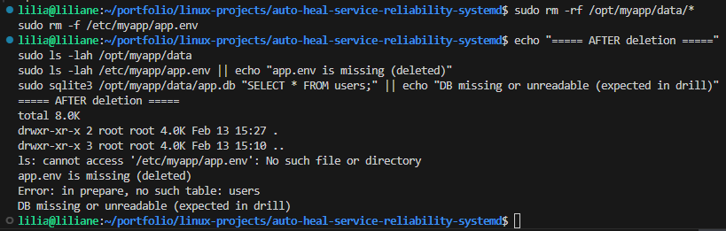
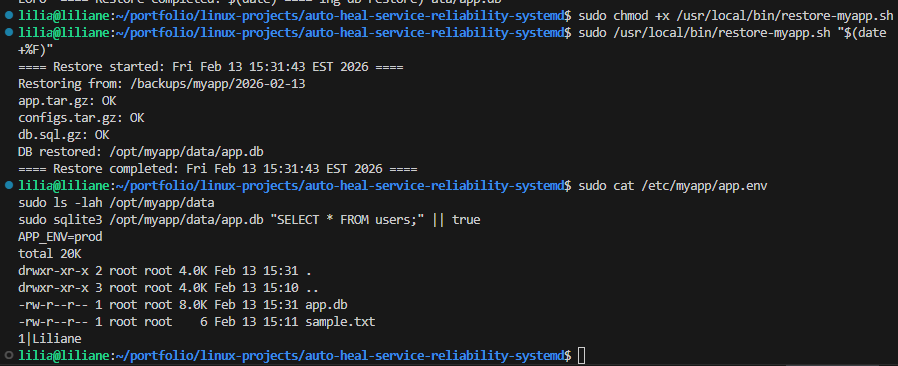

# Backup & Restore Drill (Linux) — “I can recover fast when things go wrong”

Goal: Back up important folders and prove restore works.

A hands-on project where **I practice real backup + restore like a production team**: I back up app data, configs, and a database, then I **simulate a failure** and **restore everything** to prove I can recover quickly and safely.

---

## Problem

In real environments, outages happen:

- Someone deletes a folder by mistake
- A server disk fills up and corrupts data
- A bad deploy breaks the app
- A database gets wiped or a config is overwritten

If you don’t have a tested restore process, backups are just “hope”.  
So I built a **backup + restore drill** to prove recovery works.

---

## Solution

I created a simple, repeatable backup system that includes:

- **Daily backups** (app files + config files + database)
- **Retention policy** (keep last X days)
- **Restore procedure** (tested end-to-end)
- **Verification** (checksums + service health checks)
- **Logs** (so I can troubleshoot quickly)

Then I simulate a failure and restore to confirm my recovery steps actually work.

---

## Architecture Diagram



```text
          +---------------------------+
          |        Linux Server       |
          |  /opt/myapp (app + data)  |
          |  /etc/myapp (configs)     |
          |  PostgreSQL/MySQL/SQLite  |
          +-------------+-------------+
                        |
                        | backup.sh (cron/systemd timer)
                        v
          +---------------------------+
          |      Backup Location      |
          | /backups/myapp/YYYY-MM-DD |
          |  - app.tar.gz             |
          |  - configs.tar.gz         |
          |  - db.sql.gz              |
          |  - checksums.txt          |
          |  - backup.log             |
          +-------------+-------------+
                        |
                        | restore.sh (manual drill)
                        v
          +---------------------------+
          |     Recovery Validation   |
          | - file integrity check    |
          | - db import success       |
          | - systemctl status myapp  |
          | - curl health endpoint    |
          +---------------------------+
````

---

## Step-by-step CLI

> Assumption: Ubuntu Linux.
> App path: `/opt/myapp`
> Config path: `/etc/myapp`
> Backups path: `/backups/myapp`
> Change paths as needed for your environment.

### 1) Create folders and a test app structure

```bash
sudo mkdir -p /opt/myapp/data /etc/myapp /backups/myapp /var/log/myapp
echo "APP_ENV=prod" | sudo tee /etc/myapp/app.env
echo "hello" | sudo tee /opt/myapp/data/sample.txt
```

### 2) (Optional) Create a small database to back up (SQLite demo)

> If you use MySQL/Postgres in your real environment, skip this and use the DB steps below.

```bash
sudo apt-get update
sudo apt-get install -y sqlite3

sudo sqlite3 /opt/myapp/data/app.db "CREATE TABLE IF NOT EXISTS users(id INTEGER PRIMARY KEY, name TEXT);"
sudo sqlite3 /opt/myapp/data/app.db "INSERT INTO users(name) VALUES ('Liliane');"
sudo sqlite3 /opt/myapp/data/app.db "SELECT * FROM users;"
```

### 3) Create the backup script

```bash
sudo tee /usr/local/bin/backup-myapp.sh > /dev/null <<'EOF'
#!/usr/bin/env bash
set -euo pipefail

APP_DIR="/opt/myapp"
CONF_DIR="/etc/myapp"
BACKUP_ROOT="/backups/myapp"
LOG_FILE="/var/log/myapp/backup.log"
RETENTION_DAYS=7

TODAY="$(date +%F)"
DEST="${BACKUP_ROOT}/${TODAY}"

mkdir -p "${DEST}"
mkdir -p "$(dirname "${LOG_FILE}")"

echo "==== Backup started: $(date) ====" | tee -a "${LOG_FILE}"

# 1) Backup app files
tar -czf "${DEST}/app.tar.gz" -C "${APP_DIR}" . 2>>"${LOG_FILE}"

# 2) Backup configs
tar -czf "${DEST}/configs.tar.gz" -C "${CONF_DIR}" . 2>>"${LOG_FILE}"

# 3) Backup database (SQLite demo)
if [ -f "${APP_DIR}/data/app.db" ]; then
  sqlite3 "${APP_DIR}/data/app.db" .dump | gzip > "${DEST}/db.sql.gz"
  echo "DB backup created: db.sql.gz" | tee -a "${LOG_FILE}"
else
  echo "No SQLite db found at ${APP_DIR}/data/app.db (skipping db backup)" | tee -a "${LOG_FILE}"
fi

# 4) Create checksums
(
  cd "${DEST}"
  sha256sum *.gz > checksums.txt
)

echo "Checksums created: ${DEST}/checksums.txt" | tee -a "${LOG_FILE}"

# 5) Cleanup old backups
find "${BACKUP_ROOT}" -mindepth 1 -maxdepth 1 -type d -mtime +"${RETENTION_DAYS}" -print -exec rm -rf {} \; | tee -a "${LOG_FILE}"

echo "==== Backup completed: $(date) ====" | tee -a "${LOG_FILE}"
EOF

sudo chmod +x /usr/local/bin/backup-myapp.sh
```

### 4) Run a manual backup (prove backup is created + logs are clean)

```bash
sudo /usr/local/bin/backup-myapp.sh
ls -lah /backups/myapp/$(date +%F)
sudo tail -n 50 /var/log/myapp/backup.log
```

**Screenshot — Backup folder created**


---

**Screenshot — Backup log success**


---
### 5) Schedule backups (cron)

```bash
sudo crontab -e
```

Add this line (runs daily at 1:00 AM):

```cron
0 1 * * * /usr/local/bin/backup-myapp.sh
```

Verify cron entry:

```bash
sudo crontab -l
```

---

## Restore Drill (Simulate failure + recover)

### 6) Simulate a failure (intentional)

> This is the drill: I break it on purpose so I can prove I can recover.

```bash
# Show current state
sudo ls -lah /opt/myapp/data
sudo sqlite3 /opt/myapp/data/app.db "SELECT * FROM users;" || true

# Simulate deletion/corruption
sudo rm -rf /opt/myapp/data/*
sudo rm -f /etc/myapp/app.env
```

echo "===== AFTER deletion ====="
sudo ls -lah /opt/myapp/data
sudo ls -lah /etc/myapp/app.env || echo "app.env is missing (deleted)"
sudo sqlite3 /opt/myapp/data/app.db "SELECT * FROM users;" || echo "DB missing or unreadable (expected in drill)"


**Screenshot — Simulated failure (files deleted)**



---

### 7) Create the restore script

```bash
sudo tee /usr/local/bin/restore-myapp.sh > /dev/null <<'EOF'
#!/usr/bin/env bash
set -euo pipefail

APP_DIR="/opt/myapp"
CONF_DIR="/etc/myapp"
BACKUP_ROOT="/backups/myapp"

if [ $# -ne 1 ]; then
  echo "Usage: $0 <YYYY-MM-DD>"
  exit 1
fi

DATE="$1"
SRC="${BACKUP_ROOT}/${DATE}"

if [ ! -d "${SRC}" ]; then
  echo "Backup folder not found: ${SRC}"
  exit 1
fi

echo "==== Restore started: $(date) ===="
echo "Restoring from: ${SRC}"

# Verify checksums first
( cd "${SRC}" && sha256sum -c checksums.txt )

# Restore app
sudo mkdir -p "${APP_DIR}"
sudo tar -xzf "${SRC}/app.tar.gz" -C "${APP_DIR}"

# Restore configs
sudo mkdir -p "${CONF_DIR}"
sudo tar -xzf "${SRC}/configs.tar.gz" -C "${CONF_DIR}"

# Restore DB (SQLite demo)
if [ -f "${SRC}/db.sql.gz" ]; then
  sudo mkdir -p "${APP_DIR}/data"
  sudo rm -f "${APP_DIR}/data/app.db"
  gunzip -c "${SRC}/db.sql.gz" | sudo sqlite3 "${APP_DIR}/data/app.db"
  echo "DB restored: ${APP_DIR}/data/app.db"
else
  echo "No db backup found in ${SRC} (skipping db restore)"
fi

echo "==== Restore completed: $(date) ===="
EOF

sudo chmod +x /usr/local/bin/restore-myapp.sh
```

### 8) Run the restore (recover + validate)

Use today’s date (or the folder date you want to restore):

```bash
sudo /usr/local/bin/restore-myapp.sh "$(date +%F)"
```

Validate:

```bash
sudo cat /etc/myapp/app.env
sudo ls -lah /opt/myapp/data
sudo sqlite3 /opt/myapp/data/app.db "SELECT * FROM users;" || true
```

**Screenshot — Restore command + validation output**


---

## Outcome

What I proved with this project:

* I can **create reliable backups** of application data + config + database
* I can **restore cleanly** after a real failure scenario
* I verify integrity using **checksums**
* I keep backups manageable with **retention cleanup**
* I documented the process so someone else can follow it quickly

This is the exact mindset I use for production: **backup is not complete until restore is tested.**

---

## Troubleshooting

### Backup script fails with “permission denied”

Fix:

```bash
sudo chmod +x /usr/local/bin/backup-myapp.sh
sudo chmod +x /usr/local/bin/restore-myapp.sh
```

### Backup folder is empty or missing files

Check:

```bash
sudo /usr/local/bin/backup-myapp.sh
sudo ls -lah /backups/myapp/$(date +%F)
sudo tail -n 100 /var/log/myapp/backup.log
```

### Checksum verification fails during restore

This usually means backup files were modified or incomplete.

Fix:

* Pick a different backup date folder
* Re-run a fresh backup, then restore again

```bash
ls -1 /backups/myapp
sudo /usr/local/bin/restore-myapp.sh "YYYY-MM-DD"
```

### SQLite restore fails (command not found)

Install sqlite:

```bash
sudo apt-get update && sudo apt-get install -y sqlite3
```

### Cron didn’t run

Check cron logs:

```bash
sudo grep CRON /var/log/syslog | tail -n 50
sudo crontab -l
```

---

## Next Improvements (what I would add in a real company)

* Encrypt backups (GPG or KMS if in AWS)
* Copy backups off-host (S3 / another server)
* Add monitoring + alerting on backup failures
* Automate restore tests weekly (non-prod)
* Store secrets safely (SSM Parameter Store / Vault)

