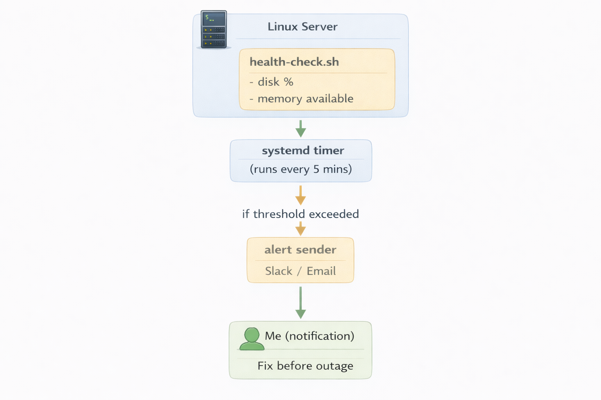

# Detect Low Disk/Memory and Alert Before Outage

## Context

In a real operations environment, servers do not always fail because of bad application code.  
Sometimes the issue is simple infrastructure pressure that grows quietly over time.

For example:

- logs keep growing until disk becomes full
- backup files accumulate and consume storage
- Docker images and containers take too much space
- one leaking process slowly eats memory
- the server becomes slow, unstable, or unavailable

This kind of problem often starts small, but if nobody sees it early, it can turn into a real outage.

I wanted a simple monitoring setup that could warn me before the server reached a critical point, so I could fix the issue early instead of reacting after production was already affected.

---

## Problem

Low disk and low memory are common server problems, but they become dangerous when they are not detected early.

If disk usage becomes too high:

- applications may stop writing logs
- services may fail to write temporary files
- deployments can fail
- databases may have write issues

If memory becomes too low:

- the server gets slow
- swap usage increases
- applications become unstable
- the operating system may kill processes

Without early alerting, I may only notice the issue after users are already impacted.  
That turns a preventable resource issue into downtime.

---

## Solution

To solve this, I built a lightweight disk and memory alerting setup.

The solution includes:

- a Bash health check script
- a systemd service and timer to run checks automatically
- Slack or email alerts when thresholds are crossed
- a local log file to keep a record of checks and alerts

The script watches for:

- disk usage reaching warning or critical levels
- memory available dropping below safe levels

When a threshold is crossed, the alert includes useful details such as:

- hostname
- current disk usage
- current memory usage
- top memory-consuming processes
- largest disk-consuming directories

This gives me enough information to respond quickly and fix the issue before it becomes an outage.

---

## Architecture



---

## Workflow with Goals + Screenshots

### Build and test the health check

**Goal:** verify the monitoring logic works before automation.

I created the health check script and tested it manually first to confirm it could detect disk and memory status correctly and produce useful output.

**Screenshot used in this project:**

- `screenshots/01-script-test.png`  
  **Should show:** successful test output from the health check script.

---

### Automate the monitoring on a schedule

**Goal:** make the checks run automatically and consistently.

After confirming the script worked, I connected it to a systemd service and timer so the monitoring runs on a schedule without manual effort.

**Screenshots used in this project:**

- `screenshots/02-timer-status.png`  
  **Should show:** the timer is active and enabled.

- `screenshots/03-list-timers.png`  
  **Should show:** the timer appears in the system timer list.

---

### Trigger a test alert

**Goal:** prove the notification path works before a real incident happens.

I forced a test alert using temporary aggressive thresholds.  
This allowed me to confirm that Slack or email alerting was working correctly.

**Screenshot used in this project:**

- `screenshots/04-slack-alert.png`  
  **Should show:** alert message received in Slack or email.

---

### Review the local log evidence

**Goal:** keep execution history for proof and troubleshooting.

I also kept a local log file so I can confirm checks are running, review previous output, and troubleshoot missed alerts more easily.

**Screenshot used in this project:**

- `screenshots/05-log-file.png`  
  **Should show:** health check log entries recorded locally.

---

## Business Impact

This project helps reduce outages by detecting server resource pressure before it becomes a production failure.

Business value:

- reduces downtime caused by full disk or memory exhaustion
- gives early warning so issues can be fixed safely
- helps prevent failed deployments and unstable services
- improves incident response with useful alert details
- reduces manual monitoring by automating repeated checks

In a real company environment, this kind of setup supports better uptime, faster action, and more stable systems.

---

## Troubleshooting

### No alert is received

Possible reasons:

- Slack webhook or email setup is missing
- thresholds were not crossed
- the service could not read environment variables
- the script ran but notification delivery failed

---

### Script works manually but not through systemd

Possible reasons:

- wrong absolute script path
- missing execute permission
- missing environment variables
- difference between shell environment and systemd environment

---

### Too many alerts

Possible reasons:

- thresholds are too low
- timer runs too often
- no cooldown logic exists

Possible improvements:

- raise thresholds
- reduce check frequency
- add cooldown logic

---

### Disk remains full after alert

Possible reasons:

- logs continue growing
- Docker artifacts are using space
- backup files or temporary files are accumulating

---

### Memory stays low

Possible reasons:

- leaking service
- too many processes
- workload is too large for the server size

---

## Useful CLI

### General verification

```bash
./scripts/health-check.sh
systemctl status disk-mem-alert.timer
systemctl list-timers | grep disk-mem-alert
sudo systemctl start disk-mem-alert.service
sudo journalctl -u disk-mem-alert.service --no-pager -n 50
tail -n 50 logs/health-check.log
````

### Disk troubleshooting CLI

```bash
df -h
du -sh ~/*
sudo du -xh /var | sort -h | tail
sudo find /var/log -type f -name "*.log" -size +100M -exec ls -lh {} \;
sudo journalctl --vacuum-time=7d
docker system df
docker system prune -af
```

### Memory troubleshooting CLI

```bash
free -h
vmstat 1 5
ps -eo pid,cmd,%mem --sort=-%mem | head
top
htop
sudo systemctl restart <service-name>
```

### Service troubleshooting CLI

```bash
systemctl status disk-mem-alert.service
systemctl status disk-mem-alert.timer
sudo journalctl -u disk-mem-alert.service --no-pager -n 100
sudo journalctl -u disk-mem-alert.timer --no-pager -n 100
ls -l /home/$USER/disk-mem-alert/scripts/health-check.sh
```

### Alert troubleshooting CLI

```bash
sudo cat /etc/default/disk-mem-alert
env | grep SLACK
```

---

## Cleanup

If I want to remove the setup, I can stop the timer and service, delete the service files, and remove the project folder.

```bash
sudo systemctl disable --now disk-mem-alert.timer
sudo systemctl stop disk-mem-alert.service
sudo rm -f /etc/systemd/system/disk-mem-alert.service
sudo rm -f /etc/systemd/system/disk-mem-alert.timer
sudo systemctl daemon-reload
rm -rf ~/disk-mem-alert
```

```

