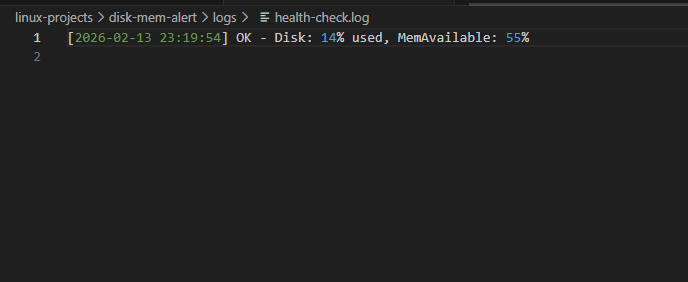
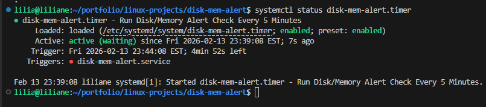
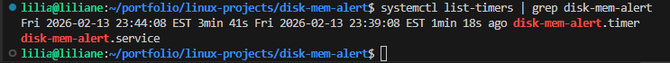
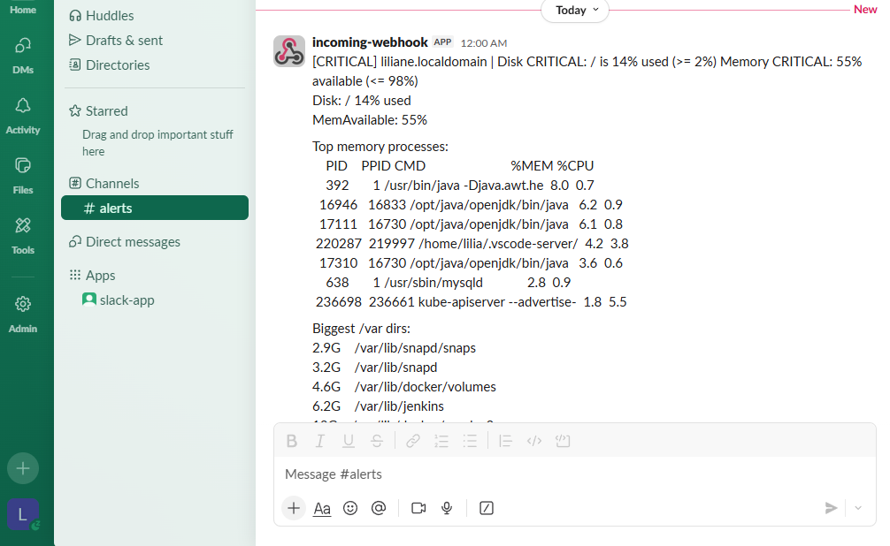
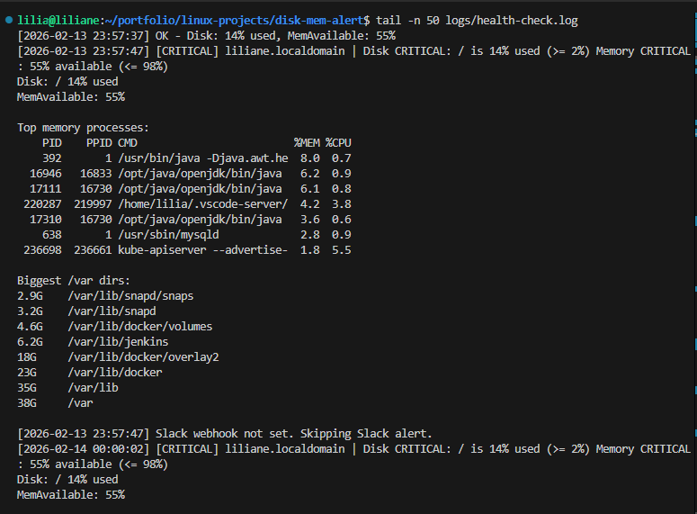

# Detect Low Disk/Memory and Alert Before Outage

Goal: Detect low disk/memory and alert before outage.

This project helps me catch **low disk space** and **low memory** *before* they take down a server.  
I set up simple monitoring + alerts so I can fix the issue early (clean logs, expand disk, restart a leaking service) instead of waiting for an outage.

---

## Problem

In real systems, outages often happen because the server runs out of:

- **Disk space** (logs grow, backups pile up, Docker images fill storage)
- **Memory** (memory leaks, too many processes, heavy services)

When disk hits **100%**, apps can’t write logs/data, and services crash.  
When memory is exhausted, the server starts swapping, becomes slow, and can freeze.

I needed an automated way to detect it early and alert me **before production breaks**.

---

## Solution

I built a lightweight alerting setup using:

- A **Bash health check script** to detect low disk/memory
- A **systemd service + timer** (or cron) to run checks automatically
- Alerts via:
  - **Email** (local mail + SMTP relay) *or*
  - **Slack webhook** *(easy + common)*

The script checks thresholds like:
- Disk usage > **80% warning**, > **90% critical**
- Memory available < **20% warning**, < **10% critical**

When thresholds are crossed, I get an alert with:
- hostname
- disk/memory usage
- top processes (for memory)
- biggest directories (for disk)

---

## Architecture Diagram


---

## Step-by-step CLI

### 1) Create project folder

```bash
mkdir -p ~/disk-mem-alert/{scripts,logs}
cd ~/disk-mem-alert
```

---

### 2) Create the health check script

```bash
nano scripts/health-check.sh
```


```bash

```

Make it executable:

```bash
chmod +x scripts/health-check.sh
```

Test it:

```bash
./scripts/health-check.sh
```

**Screenshot — Script test (OK run)**


---

### 3) (Optional but recommended) Store Slack webhook in a safe place

Create an env file:

```bash
sudo nano /etc/default/disk-mem-alert
```

Add:

```bash
SLACK_WEBHOOK_URL="https://hooks.slack.com/services/XXXXX/XXXXX/XXXXX"
```

Secure it:

```bash
sudo chmod 600 /etc/default/disk-mem-alert
```

---

### 4) Create a systemd service

```bash
sudo nano /etc/systemd/system/disk-mem-alert.service
```

Paste:

```ini
[Unit]
Description=Disk/Memory Alert Check
After=network-online.target
Wants=network-online.target

[Service]
Type=oneshot
EnvironmentFile=-/etc/default/disk-mem-alert
ExecStart=/home/%u/disk-mem-alert/scripts/health-check.sh
User=%u
```

---

### 5) Create a systemd timer (runs every 5 minutes)

```bash
sudo nano /etc/systemd/system/disk-mem-alert.timer
```

Paste:

```ini
[Unit]
Description=Run Disk/Memory Alert Check Every 5 Minutes

[Timer]
OnBootSec=2min
OnUnitActiveSec=5min
Persistent=true

[Install]
WantedBy=timers.target
```

Reload systemd and enable timer:

```bash
sudo systemctl daemon-reload
sudo systemctl enable --now disk-mem-alert.timer
```

Verify:

```bash
systemctl status disk-mem-alert.timer
```

**Screenshot — Timer status (systemctl status)**


List timers:

```bash
systemctl list-timers | grep disk-mem-alert
```

**Screenshot — Timer appears in list-timers**


Manually trigger once (proof run under systemd):

```bash
sudo systemctl start disk-mem-alert.service
sudo journalctl -u disk-mem-alert.service --no-pager -n 50
```

---

### 6) Proof: simulate an alert (Slack/email) and capture evidence

To prove alerting works without waiting for a real outage, I run a **temporary test copy** with aggressive thresholds.

Create a test copy:

```bash
cp scripts/health-check.sh scripts/health-check-test.sh
chmod +x scripts/health-check-test.sh
```

Edit the test copy thresholds (ONLY the test file):

```bash
nano scripts/health-check-test.sh
```

Set something like:

```bash
DISK_WARN=1
DISK_CRIT=2
MEM_WARN=99
MEM_CRIT=98
```

Run it:

```bash
export SLACK_WEBHOOK_URL="https://hooks.slack.com/services/XXXXX/XXXXX/XXXXX"

./scripts/health-check-test.sh
```

**Screenshot — Alert received in Slack (or Email)**


Revert cleanup (remove the test copy):

```bash
rm -f scripts/health-check-test.sh
```

---

### 7) Check the local log file (proof trail)

```bash
tail -n 50 logs/health-check.log
```

**Screenshot — Log file evidence (tail output)**


---

## Outcome

With this running, I get proactive alerts when:

* Disk starts filling up (so I can clean logs, remove unused Docker images, rotate files, expand storage)
* Memory drops too low (so I can restart a leaking service, scale resources, or investigate the heavy process)

This reduces outages because I’m fixing the issue **before** the server hits a hard limit.

---

## Troubleshooting

### Timer is running but no alerts are sent

Check if the webhook is set:

```bash
sudo cat /etc/default/disk-mem-alert
```

Confirm the script can access it:

```bash
sudo systemctl start disk-mem-alert.service
sudo journalctl -u disk-mem-alert.service --no-pager -n 80
```

### Permission denied when checking big directories

* The script uses `sudo du` for `/var`. If you don’t want sudo, remove that part or restrict to user directories.
* Quick test:

```bash
sudo du -xh /var | tail
```

### Script works manually but fails in systemd

Confirm the absolute path is correct:

```bash
ls -l /home/$USER/disk-mem-alert/scripts/health-check.sh
```

Check logs:

```bash
sudo journalctl -u disk-mem-alert.service --no-pager -n 100
```

### Too many alerts (alert fatigue)

* Raise thresholds in `health-check.sh`
* Add “cooldown” logic (send alert only once per hour)
* Reduce timer frequency from 5 minutes to 10–15 minutes

### Disk still fills up even with alerts

Clean old logs:

```bash
sudo journalctl --vacuum-time=7d
sudo find /var/log -type f -name "*.log" -size +100M -exec ls -lh {} \;
```

Docker cleanup:

```bash
docker system df
docker system prune -af
```

### Memory is always low

Check top memory processes:

```bash
free -h
ps -eo pid,cmd,%mem --sort=-%mem | head
```

Restart the service that is leaking:

```bash
sudo systemctl restart <service-name>
```

---

## Repo Structure (example)

```text
disk-mem-alert/
├── scripts/
│   └── health-check.sh
├── logs/
│   └── health-check.log
├── screenshots/
│   ├── 01-script-test.png
│   ├── 02-timer-status.png
│   ├── 03-list-timers.png
│   ├── 04-slack-alert.png
│   └── 05-log-file.png
└── README.md
```


