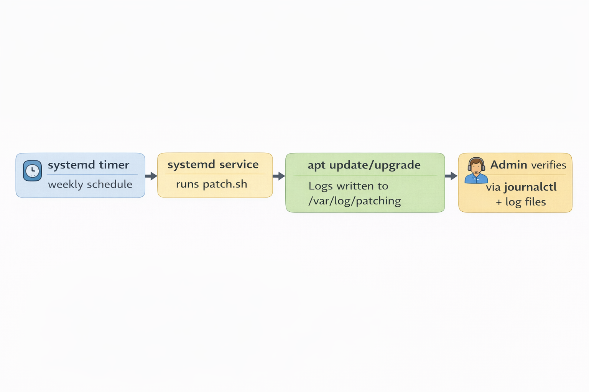
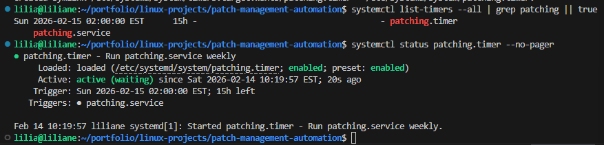
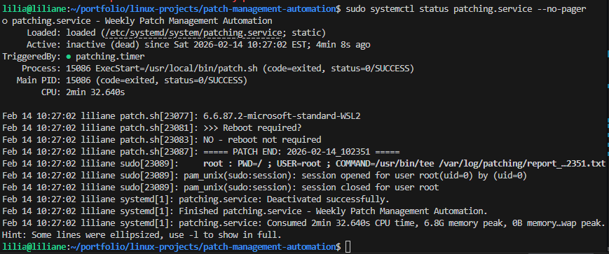
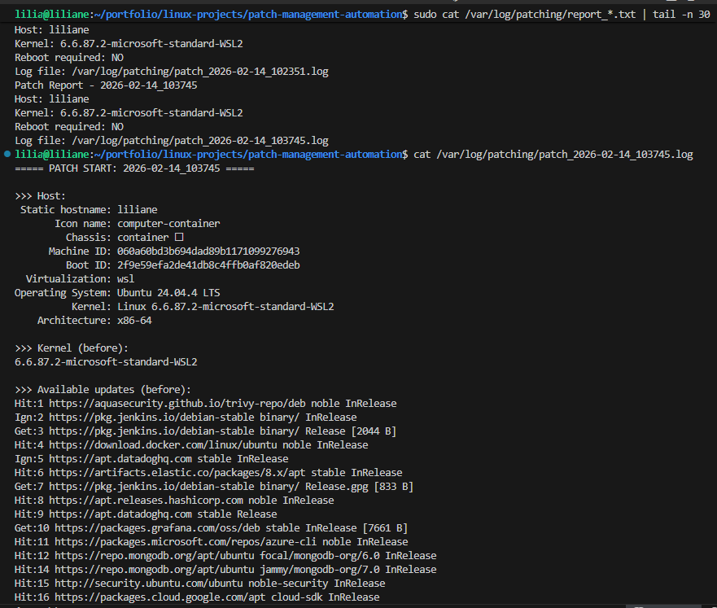

# Patch Management Automation (Linux) — Automated Weekly Updates + Reporting

## Context

Keeping Linux servers patched is part of basic system administration and security hygiene. In a real environment, servers need regular updates so security fixes, bug fixes, and package improvements are applied on time.

For this project, I built a simple patch management automation workflow on Linux to make updates happen on schedule, save logs, and make it easy to review results after each run.

This project focuses on **weekly patching with reporting and controlled reboot checks**.

---

## Problem

Manual patching creates too many risks in day-to-day operations:

* Updates may be forgotten or delayed
* Different servers may be patched at different times
* There may be no clear proof of what changed
* If something fails, it is harder to know where to investigate
* Security exposure increases when critical fixes are not applied on time

In short, manual patching is inconsistent, difficult to track, and stressful during troubleshooting or audits.

---

## Solution

I automated the patching process using a scheduled Linux patch workflow based on:

* a patch script that applies updates and writes logs
* a systemd service that runs the patch job
* a systemd timer that schedules weekly execution
* log and report output for quick validation after each run
* reboot-required detection so I can decide the next maintenance action

This gives me a repeatable way to patch Linux servers with visibility into what happened before, during, and after the update process.

---

## Architecture

The patching workflow is simple:

* **systemd timer** triggers the patch job on schedule
* **systemd service** starts the patch script
* **patch script** updates packages, records logs, and generates a short report
* **log files** provide evidence of the patch activity
* **report output** gives a quick summary for review



---

## Workflow

### 1. Weekly patch schedule is enabled

**Goal:** Make patching automatic so the server updates on schedule without depending on manual action.

The timer is configured to run weekly and remain persistent, which helps make patch execution predictable.

**Screenshot — Timer enabled and next scheduled run**


---

### 2. Patch service runs the automation job

**Goal:** Launch the patch workflow through a controlled service instead of running random manual commands.

The patching service starts the update process and provides a standard entry point for both scheduled execution and manual testing.

**Screenshot — Service run completed successfully**


---

### 3. Patch logs are written for review

**Goal:** Keep a record of patch activity so I can confirm what happened and investigate failures if needed.

The workflow saves logs in a dedicated location, which makes it easier to review results after execution.

**Screenshot — Patch log files created**


---

### 4. Detailed patch output is available

**Goal:** Quickly confirm package activity, update behavior, and reboot status from the generated log content.

This gives visibility into the patch run and helps confirm whether the server was updated successfully.

**Screenshot — Example patch log content**


---

## Business Impact

This automation improves Linux operations in a practical way:

* **Better security:** updates are applied regularly instead of being delayed
* **More consistency:** the same patch workflow runs every time
* **Easier audits:** logs and reports provide proof of patch activity
* **Faster troubleshooting:** failures can be reviewed through service status and logs
* **Lower operational risk:** reboot-required checks make post-patch actions clearer
* **Less manual work:** patching becomes a scheduled maintenance process instead of a repetitive manual task

In a real company environment, this kind of automation helps reduce missed updates, improves compliance, and makes server maintenance easier to manage.

---

## Troubleshooting

### Timer not running

If the timer does not appear active, the schedule may not be enabled correctly or systemd may need to reload unit files.

### Service failed

If the patch service fails, common causes include:

* network or DNS issues
* apt/dpkg lock already in use
* insufficient disk space
* package repository issues

### apt or dpkg lock problem

Another process such as unattended upgrades may already be using the package manager.

### Low disk space

If the system does not have enough free space, package installation or cleanup may fail.

### Reboot required after patching

Some updates, especially kernel-related updates, may require a reboot before the system is fully updated.

---

## Useful CLI

### General verification

```bash
systemctl list-timers --all | grep patching || true
systemctl status patching.timer --no-pager
systemctl status patching.service --no-pager
journalctl -u patching.service -n 100 --no-pager
```

### Check patch log output

```bash
sudo ls -lah /var/log/patching
sudo tail -n 80 /var/log/patching/patch_*.log
sudo cat /var/log/patching/report_*.txt | tail -n 30
```

### Run patch job manually for testing

```bash
sudo systemctl start --no-block patching.service
sudo systemctl status patching.service --no-pager
```

### Troubleshooting CLI

**Timer issues**

```bash
sudo systemctl daemon-reload
sudo systemctl enable --now patching.timer
systemctl list-timers --all | grep patching || true
```

**Service failure**

```bash
sudo systemctl status patching.service --no-pager
journalctl -u patching.service -n 200 --no-pager
```

**apt/dpkg lock check**

```bash
ps aux | egrep "apt|dpkg|unattended" | grep -v egrep
```

**Disk space check**

```bash
df -h
sudo du -sh /var/log/* | sort -h | tail -n 20
```

**Disk cleanup**

```bash
sudo apt-get autoremove -y
sudo apt-get clean
```

**Reboot required check**

```bash
test -f /var/run/reboot-required && echo "Reboot required"
cat /var/run/reboot-required.pkgs || true
```

---

## Cleanup

If I want to remove the automation from the server, I stop and disable the timer and service, then remove the installed units and script.

```bash
sudo systemctl stop patching.timer patching.service
sudo systemctl disable patching.timer
sudo rm -f /etc/systemd/system/patching.timer
sudo rm -f /etc/systemd/system/patching.service
sudo rm -f /usr/local/bin/patch.sh
sudo systemctl daemon-reload
```

If I also want to remove saved patch logs:

```bash
sudo rm -rf /var/log/patching
```

---
