# Secure SSH Access Hardening (No Password Login)

Goal: Lock down SSH so only keys can connect + reduce attack surface.

> Secure SSH hardening is needed to stop hackers from guessing passwords and make sure only trusted people can log in using SSH keys.


A practical Linux hardening project that replaces **password-based SSH login** with **SSH key authentication**, locks down access, and adds basic brute-force protection — so only approved users/devices can connect.

---

## Problem

Password-based SSH is easy to set up, but it’s also the most common target for:

- brute-force attacks
- credential stuffing (reused passwords)
- weak/default passwords
- accidental exposure of SSH to the internet

---

## Solution

I hardened SSH access by enforcing:

- ✅ **No password login** (SSH keys only)
- ✅ **Disable root login**
- ✅ **Limit who can SSH** (AllowUsers / AllowGroups)
- ✅ **Reduce attack surface** (optional custom SSH port)
- ✅ **Brute-force protection** (Fail2ban)
- ✅ **Firewall rules** (UFW)
- ✅ **Audit & verification steps** (logs + tests)

---

## Architecture (High-Level)

**Diagram — Key-only SSH + protection layers**
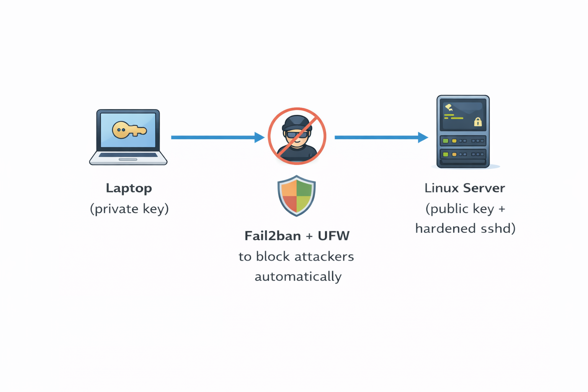

**Screenshot — Lab / server access context**


---

## Tech Stack / Tools

- Linux (Ubuntu/Debian or RHEL-based)
- OpenSSH (`sshd`)
- SSH keys (ed25519 recommended)
- `ufw` (Ubuntu) or `firewalld` (RHEL)
- `fail2ban`
- `journalctl` + `/var/log/auth.log` for auditing

---

## Project Goals

By the end of this project, you will have:

- password login disabled for SSH
- root login disabled
- only one approved user/group allowed
- firewall allowing SSH only
- automatic ban for repeated failed attempts
- a tested rollback/safety plan

---

## Prerequisites

- A Linux server (VM/EC2/on-prem) with SSH access
- A non-root user with sudo privileges (recommended)
- You can access the server from your local terminal

> ⚠️ Safety Tip: Keep your current SSH session open while testing changes.  
> Always confirm key login works **before** disabling password login.

---

## Step-by-Step Implementation

### 1) Update server and install required packages

#### Ubuntu/Debian
```bash
sudo apt update && sudo apt -y upgrade
sudo apt -y install openssh-server fail2ban ufw
sudo systemctl enable --now ssh
````

#### RHEL/CentOS/Fedora (optional)

```bash
sudo dnf -y update
sudo dnf -y install openssh-server fail2ban firewalld
sudo systemctl enable --now sshd
sudo systemctl enable --now firewalld
```

#### Proof for the screenshot 
```bash
dpkg -l | egrep 'openssh-server|fail2ban|ufw'
systemctl status ssh --no-pager
```

**Screenshot — Packages installed + SSH running**
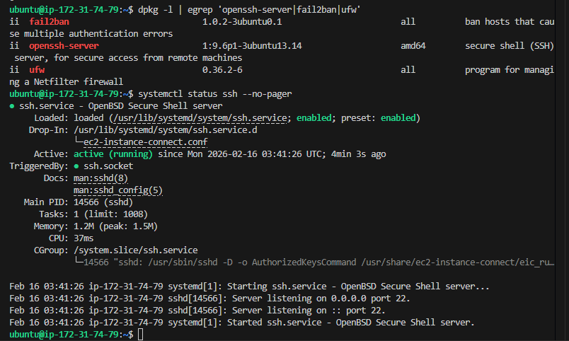

---

### 2) Create a dedicated admin user (if needed)

```bash
sudo adduser devopsadmin
sudo usermod -aG sudo devopsadmin   # Ubuntu/Debian
```

Confirm:

```bash
id devopsadmin
groups devopsadmin
```

**Screenshot — User created + groups verified**
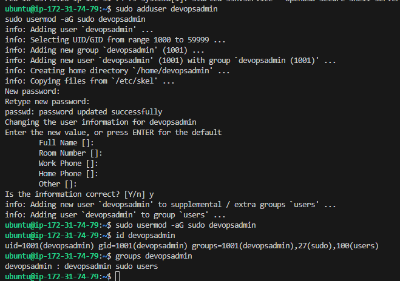

---

### 3) Generate an SSH key on your local machine

Use **ed25519** (recommended):

```bash
ssh-keygen -t ed25519 -a 64 -C "devops-ssh-key"
```

* Save to default path: `~/.ssh/id_ed25519`
* Set a strong passphrase (recommended)

Verify files exist:

```bash
ls -la ~/.ssh/id_ed25519*
```

**Screenshot — SSH key generated (ed25519)**
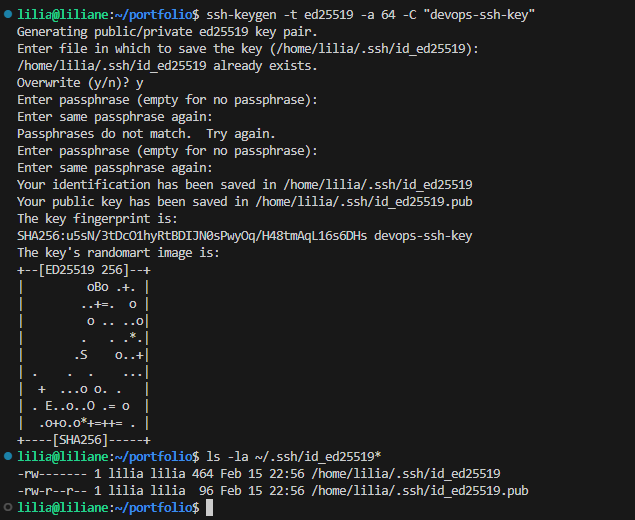

---

### 4) Copy the public key to the server

#### From the local machine, copy your public key up
```bash
scp -i ~/path/to/original-key.pem ~/.ssh/id_ed25519.pub ubuntu@3.236.82.93:/tmp/devopsadmin.pub
```
#### Now on the server (logged in as ubuntu/ec2-user):
```bash
sudo useradd -m -s /bin/bash devopsadmin 2>/dev/null || true
sudo mkdir -p /home/devopsadmin/.ssh
sudo chmod 700 /home/devopsadmin/.ssh
sudo tee /home/devopsadmin/.ssh/authorized_keys < /tmp/devopsadmin.pub > /dev/null
sudo chmod 600 /home/devopsadmin/.ssh/authorized_keys
sudo chown -R devopsadmin:devopsadmin /home/devopsadmin/.ssh
```

Test key login From the local machine:

```bash
ssh devopsadmin@<SERVER_IP>
```

✅ If you can login without typing the server password (only key/passphrase), you’re good.

**Screenshot — Public key copied to server**


---

**Screenshot — Successful key-based login**
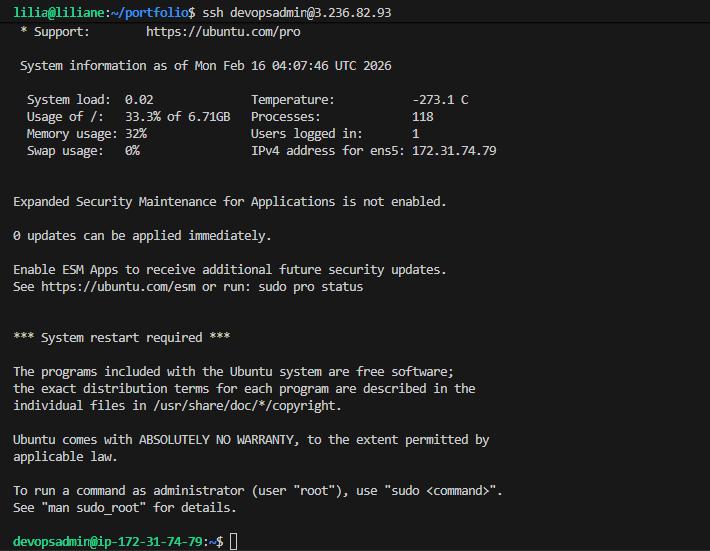

---

### 5) Harden SSH server configuration

Open SSH config:

```bash
sudo nano /etc/ssh/sshd_config
```

Apply these settings (keep only one of each setting):

```conf
# --- Secure SSH Hardening ---

# Use SSH protocol 2
Protocol 2

# Disable root login
PermitRootLogin no

# Disable password authentication (keys only)
PasswordAuthentication no
KbdInteractiveAuthentication no
ChallengeResponseAuthentication no
UsePAM yes

# Only allow specific user(s) to SSH
AllowUsers devopsadmin

# (Optional) Change default SSH port (example: 2222)
# Port 2222

# Limit authentication tries and reduce attack window
MaxAuthTries 3
LoginGraceTime 30
ClientAliveInterval 300
ClientAliveCountMax 2

# Disable empty passwords
PermitEmptyPasswords no

# Optional: disable forwarding if not needed
AllowTcpForwarding no
X11Forwarding no
```

Validate SSH config syntax (important):

```bash
sudo sshd -t
sudo sshd -t && echo "OK: sshd_config syntax is valid"

```

If no output, config is valid ✅

Restart SSH safely:

```bash
sudo systemctl restart ssh   # Ubuntu/Debian
# or
sudo systemctl restart sshd  # RHEL
```

**Screenshot — Hardened sshd_config**
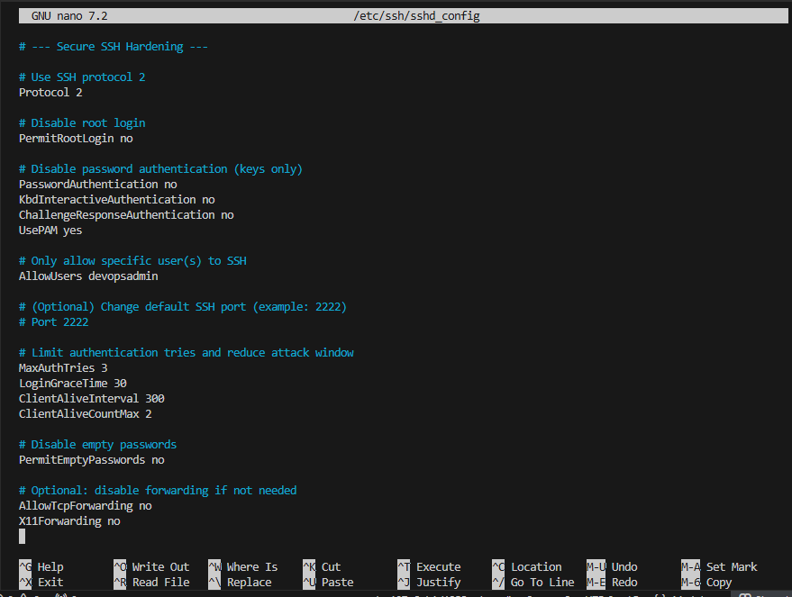

---

**Screenshot — sshd -t validation (no errors)**
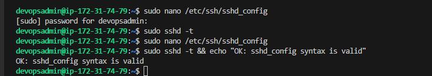

---

### 6) Configure firewall (UFW on Ubuntu)

Allow SSH (port 22):

```bash
sudo ufw allow 22/tcp
sudo ufw enable
sudo ufw status verbose
```

If you changed SSH port to 2222:

```bash
sudo ufw allow 2222/tcp
sudo ufw delete allow 22/tcp
sudo ufw status verbose
```

**Screenshot — UFW rules applied**
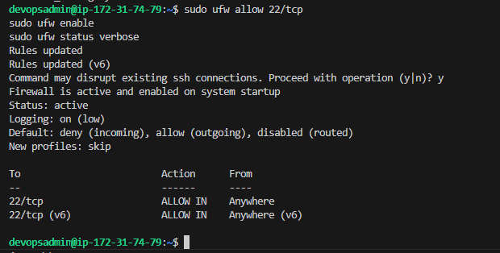

---

### 7) Enable brute-force protection using Fail2ban

Check Fail2ban status:

```bash
sudo systemctl enable --now fail2ban
sudo fail2ban-client status
```

Create local jail config:

```bash
sudo cp /etc/fail2ban/jail.conf /etc/fail2ban/jail.local
sudo nano /etc/fail2ban/jail.local
```

Add/confirm SSH jail (example):

```conf
[sshd]
enabled = true
port = ssh
logpath = %(sshd_log)s
maxretry = 5
findtime = 10m
bantime = 1h
```

Restart Fail2ban:

```bash
sudo systemctl restart fail2ban
sudo fail2ban-client status sshd
```
### Fix 
```bash
sudo grep -n '^\[sshd\]' /etc/fail2ban/jail.local
sudo nano +320 /etc/fail2ban/jail.local
```

**Screenshot — Fail2ban enabled**
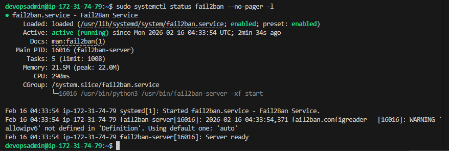

---

**Screenshot — SSHD jail active**
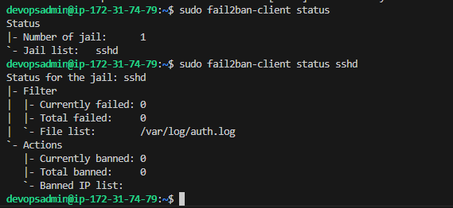

---

## Verification Checklist

### ✅ Confirm password login is disabled

From another terminal (or different machine), try:

```bash
ssh -o PreferredAuthentications=password -o PubkeyAuthentication=no devopsadmin@<SERVER_IP>
```

Expected result: **Permission denied** ✅

**Screenshot — Password login denied**
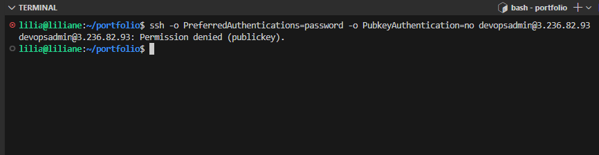

---

### ✅ Confirm key login still works

```bash
ssh devopsadmin@<SERVER_IP>
```

**Screenshot — Key login still works**
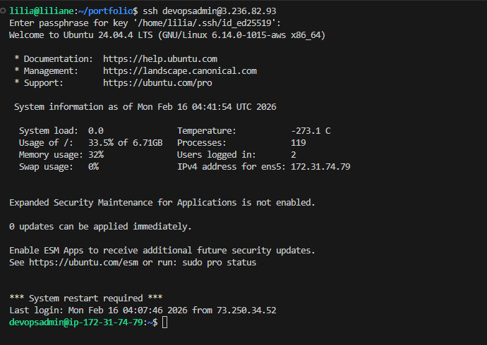

---

### ✅ Confirm root login blocked

```bash
ssh root@<SERVER_IP>
```

Expected: **Permission denied** ✅

**Screenshot — Root login denied**


---

### ✅ Check SSH logs

Ubuntu/Debian:

```bash
sudo tail -n 50 /var/log/auth.log
```

Systemd journal:

```bash
sudo journalctl -u ssh --no-pager -n 50
# or
sudo journalctl -u sshd --no-pager -n 50
```

**Screenshot — SSH logs (auth.log / journalctl)**
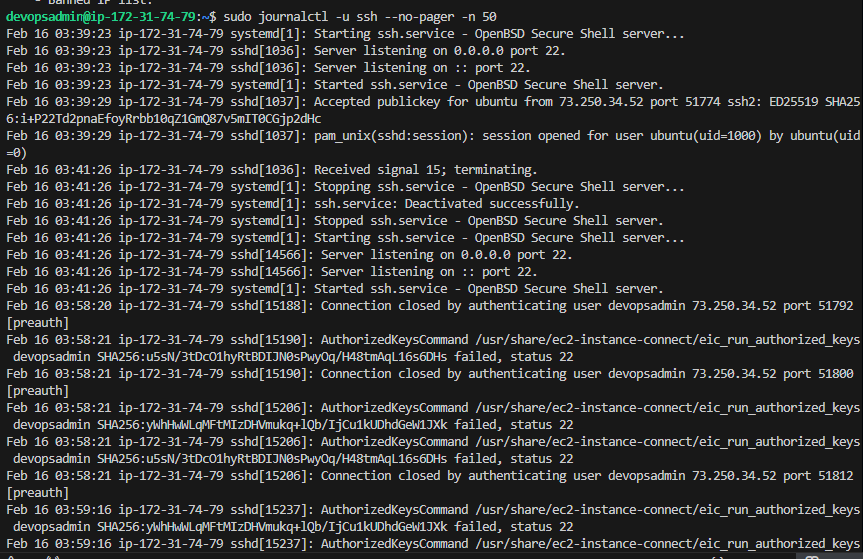

---

### ✅ Check Fail2ban bans

```bash
sudo fail2ban-client status sshd
```

**Screenshot — Fail2ban counters / bans**
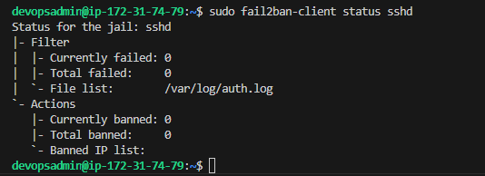

---

## Rollback / Recovery Plan (If You Lock Yourself Out)

If lose access:

1. Use cloud console / VM console access (EC2 Instance Connect, Serial console, provider console)
2. Re-enable password temporarily:

```bash
sudo nano /etc/ssh/sshd_config
# set:
PasswordAuthentication yes
PermitRootLogin prohibit-password
sudo systemctl restart ssh
```

3. Fix key issue, then disable passwords again.

**Screenshot — Recovery change applied (console access)**


---

## Security Improvements (Optional Add-ons)

✅ Restrict SSH to your IP only (UFW)

```bash
sudo ufw delete allow 22/tcp
sudo ufw allow from <YOUR_PUBLIC_IP> to any port 22 proto tcp
sudo ufw status verbose
```

✅ Add MFA for SSH via PAM (advanced)
✅ Use `AllowGroups sshusers` and manage access via group membership
✅ Use `sshd_config.d/` (modern OpenSSH) to keep configs clean
✅ Forward logs to SIEM / ELK stack for audit trails

---

## Outcome

After completing this project:

* SSH access is **key-only**
* root login is **disabled**
* only approved users can connect
* brute-force attempts are automatically blocked
* firewall rules enforce minimal exposure
* logs provide an audit trail for security and troubleshooting

---

## Troubleshooting

### “Permission denied (publickey)”

* Your key is not in `~/.ssh/authorized_keys` on the server

* Permissions are wrong:

  ```bash
  chmod 700 ~/.ssh
  chmod 600 ~/.ssh/authorized_keys
  ```

* Ensure correct user:

  ```bash
  ssh -i ~/.ssh/id_ed25519 devopsadmin@<SERVER_IP>
  ```

### “sshd won’t restart”

* Run:

  ```bash
  sudo sshd -t
  ```

* Fix the line reported, then restart again.

---

## Author

**Liliane Konissi**
GitHub: [https://github.com/lily4499](https://github.com/lily4499)
LinkedIn: [https://www.linkedin.com/in/liliane-2021](https://www.linkedin.com/in/liliane-2021)

```
```
