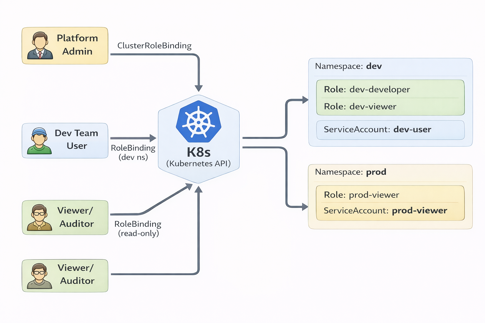
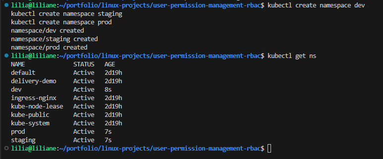
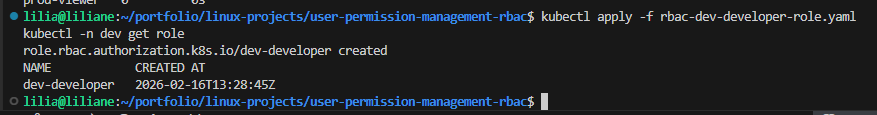
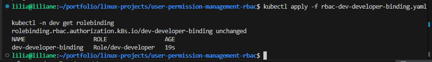
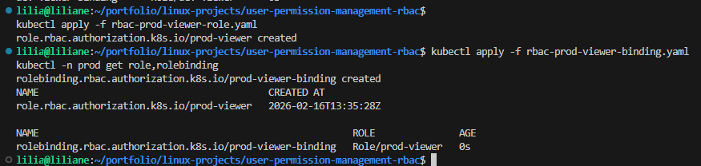
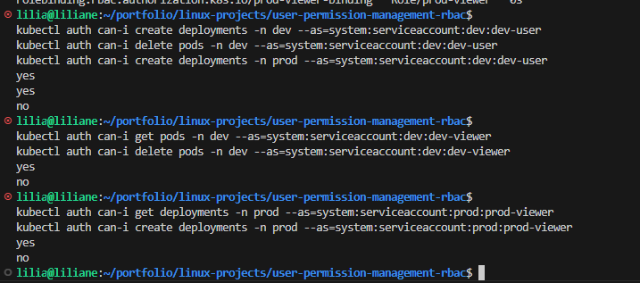

# User & Permission Management (Real Ops Scenario)  
**Kubernetes RBAC + Namespace Isolation (Least Privilege)**

## Problem

In a real environment, teams break production when:

- Everyone shares one admin kubeconfig
- Developers have more permissions than they need
- There is no separation between dev/staging/prod
- Nobody can quickly prove “who has access to what”
- An incident happens and you can’t lock down access fast

So I built a real **User & Permission Management** setup using **Kubernetes RBAC**:

- Namespaces per team/environment
- Roles/RoleBindings for least privilege
- Read-only access for viewers
- Admin access only for platform ops
- Quick audit commands to verify access

---

## Solution

I implemented **RBAC + Namespace isolation** with this approach:

- Create namespaces: `dev`, `staging`, `prod`
- Create service accounts (representing users/apps in real ops)
- Create Roles for each namespace (developer / viewer)
- Bind roles to service accounts using RoleBinding
- Verify with `kubectl auth can-i`
- Add cleanup + troubleshooting steps (real ops style)

---

## Architecture Diagram



> This diagram shows Kubernetes RBAC where the **platform admin** gets **cluster-wide access** (ClusterRoleBinding), while **dev users and viewers** get **limited, namespace-specific permissions** (RoleBindings) in **dev/prod** using Roles and ServiceAccounts.

---

## Step-by-step CLI

### Step 0 — Check cluster access

**Goal:** Make sure I’m connected to the cluster before doing RBAC work.

```bash
kubectl cluster-info
kubectl get nodes
```

---

### Step 1 — Create namespaces (dev/staging/prod)

**Goal:** Separate environments so permissions can be controlled safely.

```bash
kubectl create namespace dev
kubectl create namespace staging
kubectl create namespace prod

kubectl get ns
```

**Screenshot — Namespaces created**  


---

### Step 2 — Create ServiceAccounts (simulating real users)

**Goal:** In real ops, I don’t give people cluster-admin. I grant least privilege to a user identity.

```bash
kubectl -n dev create serviceaccount dev-user
kubectl -n dev create serviceaccount dev-viewer

kubectl -n prod create serviceaccount prod-viewer

kubectl -n dev get sa
kubectl -n prod get sa
```

---

### Step 3 — Create a Developer Role in DEV namespace

**Goal:** Dev user can manage app resources only in `dev` (deployments, services, pods, logs).

```bash
cat <<'YAML' > rbac-dev-developer-role.yaml
apiVersion: rbac.authorization.k8s.io/v1
kind: Role
metadata:
  name: dev-developer
  namespace: dev
rules:
  - apiGroups: ["", "apps", "batch"]
    resources:
      - pods
      - pods/log
      - services
      - configmaps
      - secrets
      - deployments
      - replicasets
      - jobs
      - cronjobs
    verbs: ["get","list","watch","create","update","patch","delete"]
YAML

kubectl apply -f rbac-dev-developer-role.yaml
kubectl -n dev get role
```

**Screenshot — DEV Roles created (developer/viewer roles)**  


---

### Step 4 — Bind Developer Role to dev-user

**Goal:** Grant dev-user the developer permissions only in `dev`.

```bash
cat <<'YAML' > rbac-dev-developer-binding.yaml
apiVersion: rbac.authorization.k8s.io/v1
kind: RoleBinding
metadata:
  name: dev-developer-binding
  namespace: dev
subjects:
  - kind: ServiceAccount
    name: dev-user
    namespace: dev
roleRef:
  kind: Role
  name: dev-developer
  apiGroup: rbac.authorization.k8s.io
YAML

kubectl apply -f rbac-dev-developer-binding.yaml
kubectl -n dev get rolebinding
```

**Screenshot — DEV RoleBindings created**  


---

### Step 5 — Create a Read-only Role (Viewer) in DEV

**Goal:** Viewer can only read resources and view logs (no create/update/delete).

```bash
cat <<'YAML' > rbac-dev-viewer-role.yaml
apiVersion: rbac.authorization.k8s.io/v1
kind: Role
metadata:
  name: dev-viewer
  namespace: dev
rules:
  - apiGroups: ["", "apps"]
    resources:
      - pods
      - pods/log
      - services
      - configmaps
      - deployments
      - replicasets
    verbs: ["get","list","watch"]
YAML

kubectl apply -f rbac-dev-viewer-role.yaml
kubectl -n dev get role
```

---

### Step 6 — Bind Viewer Role to dev-viewer SA

**Goal:** Give read-only permissions to the viewer identity.

```bash
cat <<'YAML' > rbac-dev-viewer-binding.yaml
apiVersion: rbac.authorization.k8s.io/v1
kind: RoleBinding
metadata:
  name: dev-viewer-binding
  namespace: dev
subjects:
  - kind: ServiceAccount
    name: dev-viewer
    namespace: dev
roleRef:
  kind: Role
  name: dev-viewer
  apiGroup: rbac.authorization.k8s.io
YAML

kubectl apply -f rbac-dev-viewer-binding.yaml
kubectl -n dev get rolebinding
```

---

### Step 7 — Create Prod Viewer Role (production is stricter)

**Goal:** Production should be read-only for most people.

```bash
cat <<'YAML' > rbac-prod-viewer-role.yaml
apiVersion: rbac.authorization.k8s.io/v1
kind: Role
metadata:
  name: prod-viewer
  namespace: prod
rules:
  - apiGroups: ["", "apps"]
    resources:
      - pods
      - pods/log
      - services
      - configmaps
      - deployments
      - replicasets
    verbs: ["get","list","watch"]
YAML

kubectl apply -f rbac-prod-viewer-role.yaml
```

```bash
cat <<'YAML' > rbac-prod-viewer-binding.yaml
apiVersion: rbac.authorization.k8s.io/v1
kind: RoleBinding
metadata:
  name: prod-viewer-binding
  namespace: prod
subjects:
  - kind: ServiceAccount
    name: prod-viewer
    namespace: prod
roleRef:
  kind: Role
  name: prod-viewer
  apiGroup: rbac.authorization.k8s.io
YAML

kubectl apply -f rbac-prod-viewer-binding.yaml
kubectl -n prod get role,rolebinding
```

**Screenshot — PROD RBAC (role + binding)**  


---

### Step 8 — Verify permissions (real ops checks)

**Goal:** I always verify permissions before calling it done.

✅ Check dev-user permissions in `dev`:

```bash

kubectl auth can-i create deployments -n dev --as=system:serviceaccount:dev:dev-user
kubectl auth can-i delete pods -n dev --as=system:serviceaccount:dev:dev-user
kubectl auth can-i create deployments -n prod --as=system:serviceaccount:dev:dev-user
```

✅ Check dev-viewer permissions:

```bash

kubectl auth can-i get pods -n dev --as=system:serviceaccount:dev:dev-viewer
kubectl auth can-i delete pods -n dev --as=system:serviceaccount:dev:dev-viewer
```

✅ Check prod-viewer permissions:

```bash

kubectl auth can-i get deployments -n prod --as=system:serviceaccount:prod:prod-viewer
kubectl auth can-i create deployments -n prod --as=system:serviceaccount:prod:prod-viewer
```

**Screenshot — Permission verification (kubectl auth can-i)**  


---

## Outcome

After implementing this:

- Dev users can deploy and manage apps only inside `dev`
- Viewers can only read resources and logs
- Production is protected with stricter access
- I can quickly validate permissions with `kubectl auth can-i`
- This matches a real ops setup: **least privilege + environment isolation**

---

## Troubleshooting

### 1) “Forbidden” errors when user tries an action

**Cause:** Missing Role/RoleBinding or wrong namespace.  
**Fix:**

```bash
kubectl -n dev get role,rolebinding
kubectl auth can-i get pods -n dev --as=system:serviceaccount:dev:dev-user
```

---

### 2) RoleBinding created but permissions still not working

**Cause:** Binding references the wrong Role name or wrong subject namespace.  
**Fix:**

```bash
kubectl -n dev describe rolebinding dev-developer-binding
kubectl -n dev describe role dev-developer
```

---

### 3) “can-i” works in dev but not in prod

**Cause:** RBAC was only applied in dev namespace (expected).  
**Fix:** Apply a separate role/binding in prod (prod should be stricter anyway).

---

### 4) Want to revoke access fast (incident response)

**Fix:** Delete the binding:

```bash
kubectl -n dev delete rolebinding dev-developer-binding
kubectl -n dev delete rolebinding dev-viewer-binding
```

---

### 5) Clean up everything

```bash
kubectl delete -f rbac-dev-developer-role.yaml
kubectl delete -f rbac-dev-developer-binding.yaml
kubectl delete -f rbac-dev-viewer-role.yaml
kubectl delete -f rbac-dev-viewer-binding.yaml
kubectl delete -f rbac-prod-viewer-role.yaml
kubectl delete -f rbac-prod-viewer-binding.yaml

kubectl delete namespace dev staging prod
```

---

## Repo Structure

```bash
.
├── README.md
├── rbac-dev-developer-role.yaml
├── rbac-dev-developer-binding.yaml
├── rbac-dev-viewer-role.yaml
├── rbac-dev-viewer-binding.yaml
├── rbac-prod-viewer-role.yaml
├── rbac-prod-viewer-binding.yaml
└── screenshots/
    ├── 01-namespaces.png
    ├── 02-dev-roles.png
    ├── 03-dev-bindings.png
    ├── 04-prod-rbac.png
    └── 05-can-i-checks.png
```
